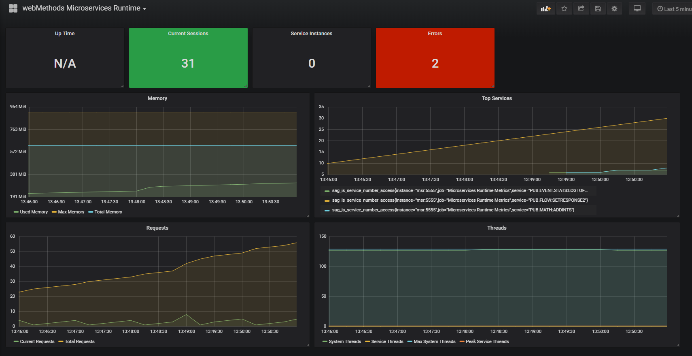

Microservices Runtime Sample for monitoring with Prometheus and Grafana

The Microservices Runtime Sample for monitoring with Prometheus and Grafana allows you to run Microservices runtime in Docker container and monitor it with Prometheus and Grafana. 

After successful execution of the sample, you should be able to see dashboard in Grafana like below.

This project uses the Apache License Version 2.0. For details, see [the license file](LICENSE).

Important!
--

You need to agree to download webMethods Microservices Runtime Docker image from Docker store https://hub.docker.com/_/softwareag-webmethods-microservicesruntime. Use the username and password of your Docker Store account that you used to accept license for the webMethods Microservices Runtime Docker image in your Docker environment. i.e. make sure you use "docker login" command with the same username and password.

Ensure that you have docker stack functional in your environment - https://docs.docker.com/engine/reference/commandline/stack/.

To install and run the sample, 
--

This instruction is if you are running different components in Docker container. If you are not using Docker infrasturcture, refer to [standalone instructions](standalone).

1.	Clone the webmethods-microservicesruntime-prometheus repository.  
`git clone https://github.com/SoftwareAG/webmethods-microservicesruntime-prometheus.git`

2.	Go to the root directory of the repository.  
`cd webmethods-microservicesruntime-prometheus`

3.	Deploy the stack.  
`docker stack deploy -c docker-compose.yml wm-msr`

4.	Once components are running, you can login to Grafana. Replace localhost with the name of your Docker host.  
http://localhost:3000. admin/admin is the default username/password. You will be prompted to change the password. 

5. Click on http://localhost:3000/dashboards and select webMethods Microservices Runtime Dashboard from Manage Dashboard section.

6. To undeploy the stack. 
`docker stack rm wm-msr`

For more information about Microservices Runtime, see the official Software AG Microservices Runtime documentation.

______________________
These tools are provided as-is and without warranty or support. They do not constitute part of the Software AG product suite. Users are free to use, fork and modify them, subject to the license agreement. While Software AG welcomes contributions, we cannot guarantee to include every contribution in the master project.

Contact us at [TECHcommunity](mailto:technologycommunity@softwareag.com?subject=Github/SoftwareAG) if you have any questions.
